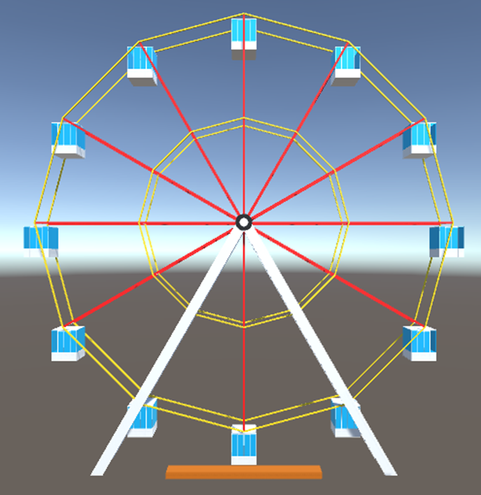
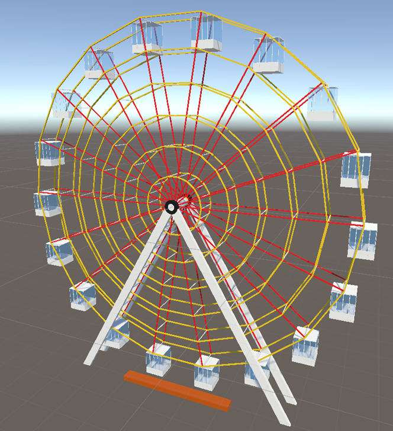
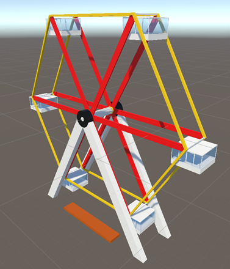

# Модель аттракциона

Курсовая работа по дисциплине "Технология программирования на платформе .NET и её применение в мехатронике"

## Постановка задачи

Смоделировать аттракцион в Unity, используя меши для создания отдельных цельных деталей механизма (можно создавать непосредственно в Unity, также возможно импортирование из стороннего 3d редактора) и различные виды соединений (joints) для совмещения их в один аттракцион.

## Результаты

В процессе работы была создана модель колеса обозрения средствами движка Unity. Модель создаётся при помощи окна конструктора (ScriptableWizard), где могут быть настроены такие параметры модели как:
- Cabin Height (Высота кабинки)
- WX (Толщина соединения по оси OX)
- WZ (Толщина соединения по оси OZ)
- WD (Расстояние между кольцами каркаса колеса обозрения)
- Approximation (Число точек, по которым строятся кольца каркаса)
- Num of Rings (Число колец каркаса колеса обозрения)
- Материалы, которые будут использованы для отрисовки соединений, центрального цилиндра, колец, опор, кабинок и платформы

### Несколько примеров моделей, сгенерированных в процессе работы:

Модель приводится в движение с помощью мотора, привязанного к центральному цилиндру. Двери кабинок при помощи скрипта DoorsScript приводятся в движение, при достижении зоны высадки, представляющей собой прямоугольный коллайдер, расположенный около платформы. Движение модели было исследовано при разных параметрах и описано более подробно в отчёте.

### Оптимизация сеток объектов

В связи с тем, что модель генерируется из большого количества деталей, движок испытывает довольно сильную нагрузку, так как ему требуется обработать большо число объектов. Чтобы оптимизировать использование ресурсов движка и избавится от фризов и подлагиваний, я при помощи скрипта объединил мэши всех этих объектов в несколько основных, благодаря чему программа стала работать намного лучше.

Основная сложность с которой мне пришлось столкнуться при реализации этой оптимизации это тот факт, что сами объекты класса Mesh не имеют описания материала, и он записывается в MeshRender, который вместе с исходной сеткой не передаётся, поэтому возникает вопрос: как сохранить исходные материалы, объединив сетки объектов? В процессе работы мне удалось найти ответ: для этого можно использовать сабмеши или подсети. Для этого потребовалось провести переиндексацию всех вершин и граней, составлявших сетки объектов, по новой пересобрать полигоны и разбить их на подсетки, каждая из которых отвечала за свой материал. Более подробно с процессом можете ознакомиться в Приложении А отчёта
