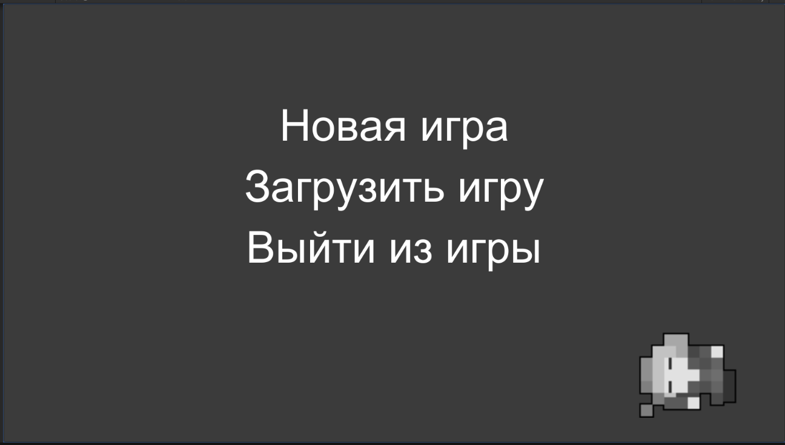
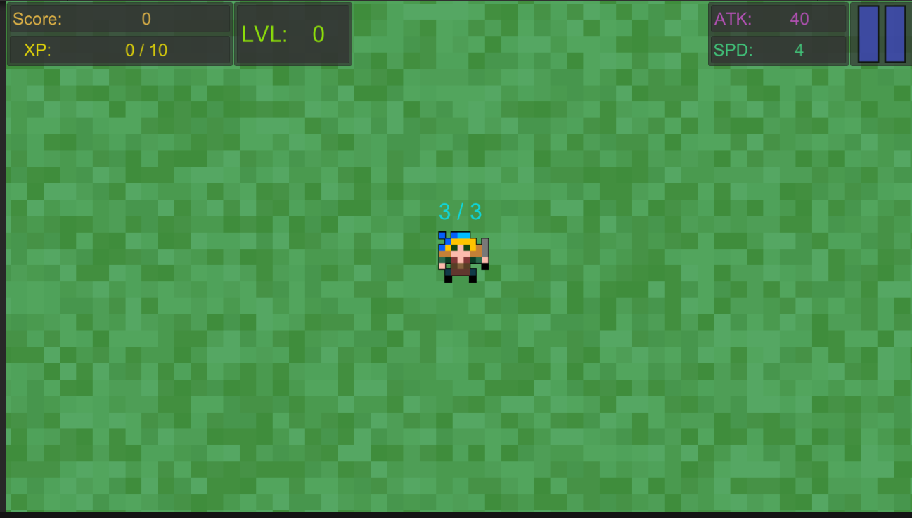
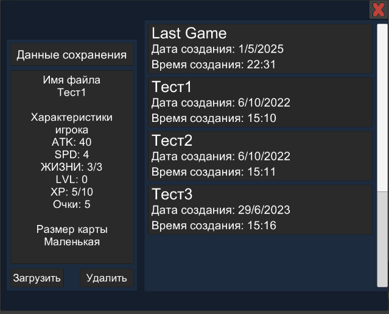
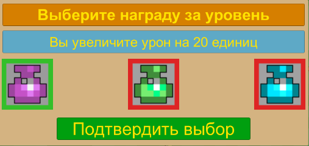
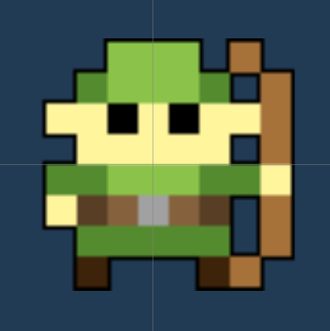

# Игра

## Постановка задачи

1. Создать свою несложную игру используя навыки, полученные во время прохождения курса "Технология программирования на платформе .NET"
2. Реализовать анимацию персонажа при помощи компонента Animator
3. Реализовать XML-сериализацию и XML-десериализацию

## Описание игры
Игра содержит:
- Две сцены:
    - MainMenu - исходная сцена для начала игры с возможностью создания новой игры, загрузки файла, сохранения и соответственно выхода из игры
    - GameScene - основная сцена игры, в которой и будет происходить весь игровой процесс

Игровой процесс:

Начиная новую игру, игрок появляется в центре карты, сгенерированной случайно при помощи скрипта MapGenerator, на экране игрок может видеть такие параметры как:
- Количество очков (Score)
- Текущий прогресс уровня (XP)
- Текущий уровень (LVL)
- Значение параметра атаки
- Значение параметра скорости перемещения
- Количество жизней

### Игрок
Игрок может совершать следующие действия:
- Перемещение с помощью клавиш WASD
- Атака при помощи нажатия/зажатия левой кнопки мыши
- При нажатии клавиши Esc вызывается меню паузы, в котором игрок может:
    - Продолжить игру
    - Сохранить игру, записав свой прогресс в XML файл с выбранным названием
    - Загрузить сохранённую ранее игру
    - Выйти обратно в основное меню

Прокачка героя происходит следующим образом:
- За каждое убийство игроку начисляется опыт и очки, равные максимальному количеству здоровья врага, делённое на 50
- Когда опыт достигает необходимой отметки, появляется бонусное меню, в котором игрок может выбрать награду за уровень. В качестве награды игроку могут выпасть увеличение количества здоровья, атаки или скорости. Качество улучшений может быть красным, зелёным и синим (в порядке от худшего к лучшему).
- Количество опыта требуемое для нового уровня рассчитывается как (maxXP * 1.2)

Когда количество здоровья игрока падает до нуля игра заканчивается и выводится панель со статистикой

### Враги
Со временем на некотором расстоянии от игрока появляются противники, генерируемые при помощи скрипта EnemiesGenerator

У противников описано следующее поведение:
- Они стремятся к текущей позиции игрока, следуя по кратчайшему пути
- Периодически при помощи карутины Fighting противники выпускают стрелы, которые при попадании наносят одну единицу урона игроку
- Противники генерируются с помощью карутины SpawnEnemy каждые 2 секунды
- Противники начинают игру с 50 очками здоровья, но каждые 20 секунд здоровье новых врагов увеличивается на 50 (здоровье уже существующих врагов не меняется) 
- При смерти объекты врагов не уничтожаются, а обездвиживаются и телепортируются за карту, это сделано для экономии ресурсов компьютера при помощи пула объектов, так как операция создания и удаления объектов довольно дорогая, а поступая таким образом мы можем переиспользовать существующие объекты. Максимальное количество врагов на карте одновременно = 10
- Если враг находится слишком далеко от игрока, он уничтожается и перегенерируется

### Сохранения
В игре реализованы сохранения, при помощи XML-сериализации

XML-файл хранит следующие параметры:
- Текущее здоровье новых врагов
- Скорость игрока
- Координаты границы, до которой игрок может дойти
- Текущее здоровье игрока
- Максимальное здоровье игрока
- Текущий счёт игрока
- Текуший опыт игрока
- Опыт требуемый для повышения уровня игрока
- Текущий уровень игрока
- Длина карты
- Матрицу клеток карты

Загрузка позволяет восстановить все эти данные, но позиция игрока и враги сбрасываются в процессе, так как они не сохраняются

### Звуки
В игре используется основная тема игры "Realm of The Mad God"

При смерти проигрывается звук смерти из этой же игры

### Анимация
Была выполнена несложная анимация для бездействия, ходьбы и атаки игрока и врагов при помощи компонента Animator

### Изображения основных компонентов игры

Основное меню игры

Основная сцена игры

Меню загрузки

Бонусное меню прокачки

Враг
